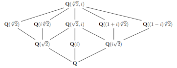

---
#
# By default, content added below the "---" mark will appear in the home page
# between the top bar and the list of recent posts.
# To change the home page layout, edit the _layouts/home.html file.
# See: https://jekyllrb.com/docs/themes/#overriding-theme-defaults
#
layout: home
title: Math 280 Strategies of Proof
---

**Instructor:** Dr. W. Riley Casper

**Email:** wcasper@fullerton.edu

**Course meetings:** Monday and Wednesday 1:00PM-3:00PM

**Office hourse:** M,W 12-1 in MH 512 and 3-4 in MH 491

**Syllabus:** <a target="_parent" href="syllabus.html">Course syllabus (link)</a>

**First steps**

Please familiarize yourself with the syllabus and the Canvas site for this course, starting with the Orientation Module.
Also, be sure that you have the necessary technological requisites:
* A reliable internet connection
* A webcam
* A microphone

Please reach out as soon as possible if you have any questions or concerns.

***

## New posts!

